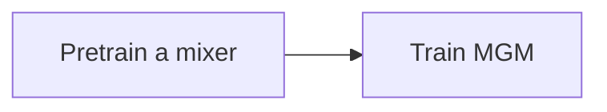

# Experiment for synthetic data

This implementation produces results of the first experiment on synthetic data in the paper. 

## Setup
### Install requirements
Please install python packages in the `requirements.txt` first.
### Data
Download the data used in the MGM: https://drive.google.com/drive/folders/1as0HSESK1JOp2KkguDAWlPugKNfWJoUE?usp=sharing

To run the code in this repository as is, download the .csv files to the `data` folder. 

## Training MGM
The procedure of training a MGM model is illustrated as follows:


The implementation provides a flag to specify the training object, such as an agent in low data scenario (`agent_low`), a mixer (`mixer`), a MGM model in low data scenario (`mgm_low`) (there are also biased data version). For example, to train an agent:

```
# Train agent
$ python main.py \
    --object agent_low \
    --trainingMode singlerun \
    --batch_size 32 \
    --data_size 32 \
    --trackTraining all
```

See the code for how to modify the default values of other training parameters or hyperparameters.